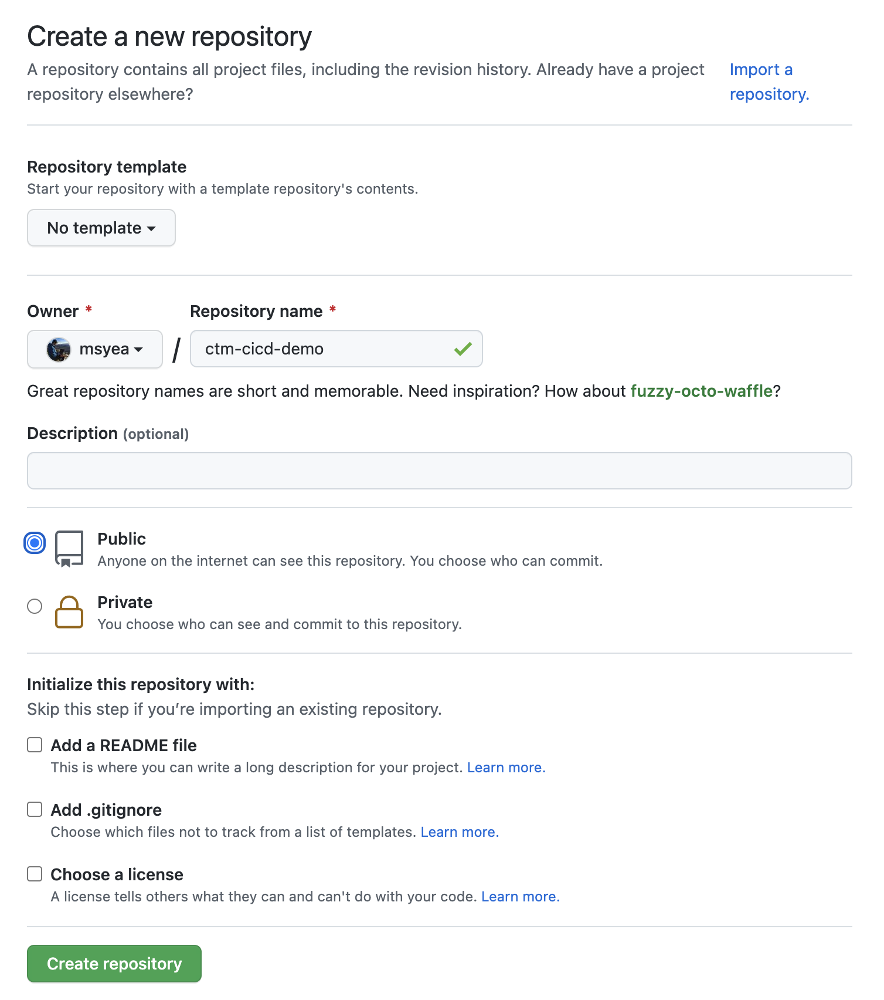
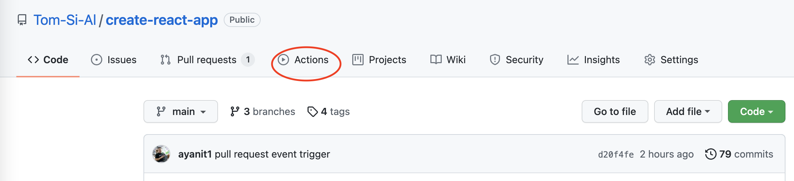
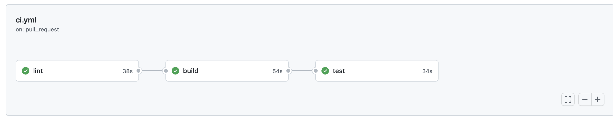

# Compare the Market intro to CICD

This project was created for the [Learn about Continuous Integration with Compare the Market
](https://codebar.io/events/continuous-integration-with-compare-the-market) [CodeBar](https://codebar.io) event.

In this presentation we will [deploy](https://create-react-app.dev/docs/deployment/#github-pages) the [React Create App](https://reactjs.org/docs/create-a-new-react-app.html) to [GitHub Pages](https://pages.github.com/). The app is deployed to https://tom-si-al.github.io/ctm-cicd-demo/

The React Create App creates a simple React boilerplate app.  GitHub Pages is free hosting that can be synced directly from your GitHub repository.

## In the event we will demo the following

### [Simon Mayes](https://github.com/msyea)


* Introduce GitHub Pages and the Create React App
* Demo the deployed application
* Make some changes locally and deploy manually to GitHub pages (let's hope I don't introduce a 🐛!)

### [Tom Bastian](https://github.com/tomjbast)


* Will rescue the situation and introduce linting and tests to prevent regressions
* Demo how you can run the test suite in GitHub Actions to ensure that they're definitely run on each commit

### [Albert Yanit](https://github.com/ayanit1)


* Will show how you can enforce that the Continuous Integration Suite runs and blocks the PR
* Merge the commit from the branch to main
* Demo how to do a Release and Continuous Deployment to GitHub Pages 🎉

### [Simon Mayes](https://github.com/msyea)

* Will demo our new Future CI model and how complex CICD might work at CtM

## How to use this repo
You cannot fork the repo because you need to run GitHub Actions in your own account (forks run in ours).

First you need to create a new repository with the following settings:


```
# clone our repository
git clone git@github.com:Tom-Si-Al/ctm-cicd-demo.git
# change the origin from our repository to yours
git remote set-url origin git@github.com:YOUR_USERNAME/ctm-cicd-demo.git
# push to your new repo
git push -u origin main
```


SI
Github pages - free hosting that you can tack off the back off a repo
Intro create react app
Demo url of gh page - scope of what app does
Make a breaking change - don't run or talk about test - syntax error - break build folder 
Push to GitHub pages and break site

Tom
Guard rails - mitigate breaking change
Tests 
Linting or compiling
Push
Functional test that fails
False to true for validation push that up
Talk about CI

Albert
* CI workflow
  * Brief introduction to Github Actions. For more information see the [Github Actions documentation](https://docs.github.com/en/actions). GitHub Actions allow us to automate, create, customize and execute software development workflows direct from your repositories
  * 3 Keywords to remember is Workflow, Job and steps. It may potentially be different for other CI providers but this is Github's syntax

* Introduction of the example CI workflow
  * Workflow is accessed by clicking the actions tab on the repository

  

  * Split into 3 jobs lint, build, test

  

* How the code looks?
  * To see this in code look at the [.github/workflows/ci.yml file](https://github.com/Tom-Si-Al/create-react-app/blob/main/.github/workflows/ci.yml)
  * What the yaml file does?
  CI job uses the pull request event trigger
  Check out code so the job has knowledge of your repository
  Install. You install the dependencies to prepare the environment of your app
  Style. Are there any incorrect syntax?
  Build the app. Any compilation errors?
  Test. Are the unit test passing?
  * We've automated the commands that Tom ran locally. It doesn't necessarily mean you don't have to run them locally anymore, it's just more guard rails to your work

* After running the workflow
  * Green ticked box in PR
  * Red cross failing build. I could not merge this PR if our workflow fails

* CD workflow
  * Very similar to the CI setup. You set up the environment to which the workflow runs. This can be found in the [.github/workflows/ci.yml file](https://github.com/Tom-Si-Al/create-react-app/blob/main/.github/workflows/cd.yml)
  * The event trigger is on published event which occurs when you publish a release

* Results of our deploy to production

Si
More complicated model
Our pipelines
Future CI

# Getting Started with Create React App

This project was bootstrapped with [Create React App](https://github.com/facebook/create-react-app).

## Available Scripts

In the project directory, you can run:

### `npm start`

Runs the app in the development mode.\
Open [http://localhost:3000](http://localhost:3000) to view it in the browser.

The page will reload if you make edits.\
You will also see any lint errors in the console.

### `npm test`

Launches the test runner in the interactive watch mode.\
See the section about [running tests](https://facebook.github.io/create-react-app/docs/running-tests) for more information.

### `npm run build`

Builds the app for production to the `build` folder.\
It correctly bundles React in production mode and optimizes the build for the best performance.

The build is minified and the filenames include the hashes.\
Your app is ready to be deployed!

See the section about [deployment](https://facebook.github.io/create-react-app/docs/deployment) for more information.

### `npm run eject`

**Note: this is a one-way operation. Once you `eject`, you can’t go back!**

If you aren’t satisfied with the build tool and configuration choices, you can `eject` at any time. This command will remove the single build dependency from your project.

Instead, it will copy all the configuration files and the transitive dependencies (webpack, Babel, ESLint, etc) right into your project so you have full control over them. All of the commands except `eject` will still work, but they will point to the copied scripts so you can tweak them. At this point you’re on your own.

You don’t have to ever use `eject`. The curated feature set is suitable for small and middle deployments, and you shouldn’t feel obligated to use this feature. However we understand that this tool wouldn’t be useful if you couldn’t customize it when you are ready for it.

## Learn More

You can learn more in the [Create React App documentation](https://facebook.github.io/create-react-app/docs/getting-started).

To learn React, check out the [React documentation](https://reactjs.org/).


